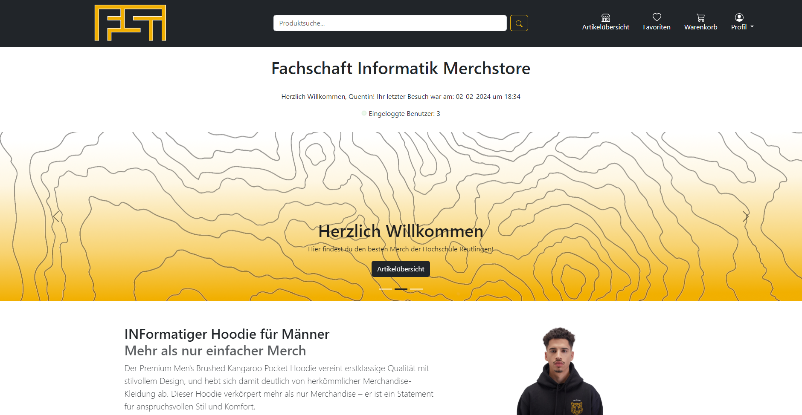

# Student Webshop Group Project

## Overview

Welcome to the README for our student webshop group project! This document serves as a guide for the development team and provides essential information about the project.

## Project Description

This webshop project is a collaborative effort by Reutlingen University students. The goal is to design and implement a fully functional e-commerce platform. The webshop will e.g. allow users to browse products, add them to their cart, and proceed through the checkout process.

## Technologies Used

- **Frontend:**
  - HTML5 🌐
  - [php](www.php.net) 🐘
  - CSS3 🎨
  - JavaScript 🚀
  - [Bootstrap](https://getbootstrap.com/docs/5.3/getting-started/introduction/) 🅱️

- **Backend:**
  - [XAMP](www.apachefriends.org) 🚀
  with
    - [MySQL](www.mysql.com) 🗄️
    - [Apache](apache.org) 🌐

## How to run it yourself
- Install XAMPP and VS-Code
- open the *htdocs* folder inside VS-Code as well as an Terminal (make shure your there as well in the htdocs folder)
- run the comand *git clone "URL of the repository"*
- start XAMPP and go to *[http://localhost/phpmyadmin/index.php](http://localhost/phpmyadmin/index.php) (can vary)* to set up the database of the webshop
- start by creating an database called: **webShopFSI**
- insert the SQL file: **schemaFSI.sql**
- you can find the shop under *[http://localhost/webShop/views/homepage.php](http://localhost/webShop/views/homepage.php) (can vary)*

## Contributing

We welcome contributions from all team members. To contribute, follow these steps:

1. Fork the repository.
2. Create a new branch for your feature: `git checkout -b feature-name`
3. Make your changes and commit them: `git commit -m "Description of changes"`
4. Push your changes to your fork: `git push origin feature-name`
5. Open a pull request on the main repository.

## Issues and Bugs

If you encounter any issues or find bugs, please open an issue on the [GitHub repository](https://github.com/L4XB/webShop/pulls ).

## Team Members

- [L4XB](https://github.com/L4XB)
- [moechtegernmoench](https://github.com/moechtegernmoench)
- [QW_ellCODe](https://github.com/QWellCOD)

## License

This project is licensed under the [AGPLv3 License](https://github.com/L4XB/webShop/blob/main/LICENCE). See the [LICENSE](https://github.com/L4XB/webShop/blob/main/LICENCE) file for details.

## Homepage

## Profile

## Products

## Checkout

Happy coding! 🚀
